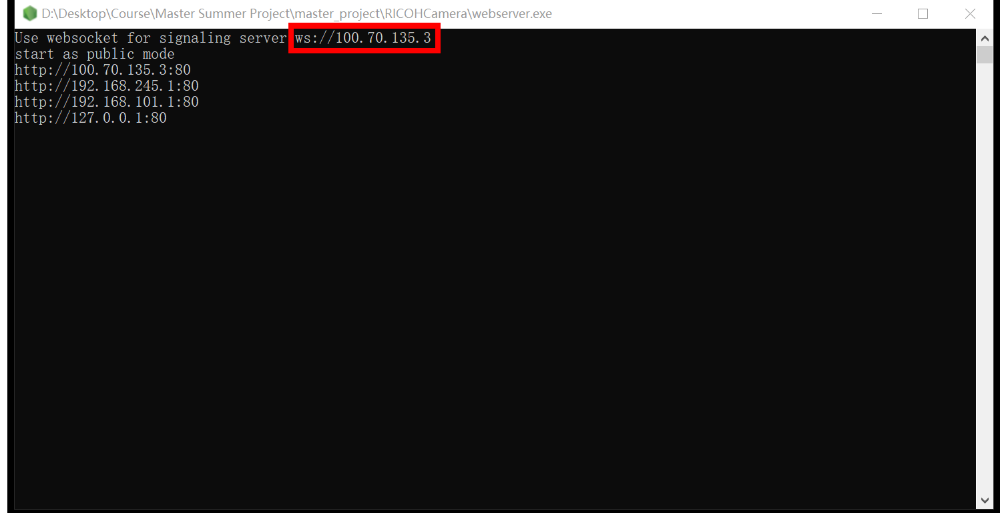
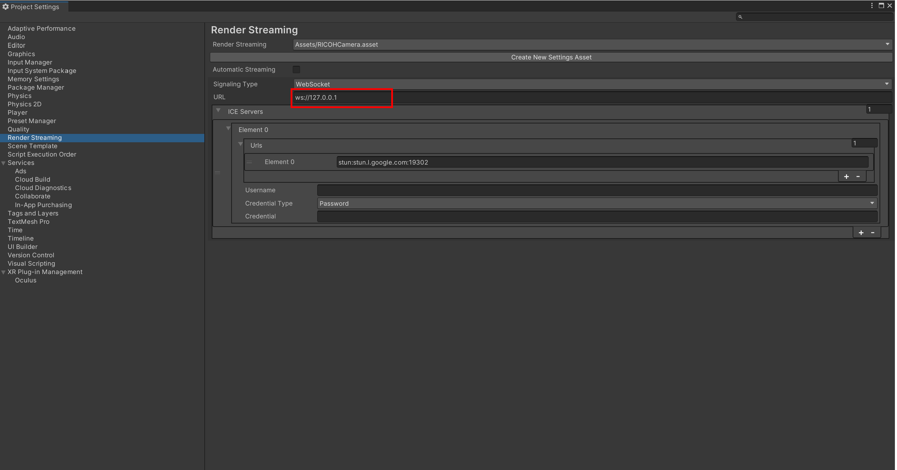

# Telepresence Robotics
## Authors: 
### Yicheng Gong
If you have any questions or issues related to running the code, please contact me via email (yicheng.gong.22@ucl.ac.uk).

## Introduction
A telepresence robotics vision system with low latency has been developed through 360-degree panoramic video. To overcome the latency issue in real time transmission of 360-degree panoramic video, a low latency transmission method has been proposed, which involves lowering the resolution for transmission and then restoring it through a super resolution network. In this project, the code is primarily divided into four main sections.

## Section 1: Latency Measurement
This section primarily contains the code proposed for latency measurement in a virtual environment. And the detailed code in 'LatencyMeasurement' Folder.

### Requirements
- [Anaconda](https://www.anaconda.com/download/)
- ipykernel
```
conda install -c conda-forge ipykernel
```
- numpy
```
conda install -c conda-forge numpy
```
- opencv
```
conda install -c conda-forge opencv
```
- pytesseract
```
conda install -c conda-forge pytesseract
```
- matplotlib
```
conda install -c conda-forge matplotlib
```
- [Tesseract](https://github.com/tesseract-ocr/tesseract)

### Run plot.ipynb
1. The project's test-recorded videos have been uploaded to the 'Videos' folder. 
2. Modify the path of 'tesseract.exe' in the following code
```
pytesseract.pytesseract.tesseract_cmd = r'your 'tesseract.exe' path'
```
3. Run the code step by step from top to bottom.

## Section 2: App in Telepresence Robotics
This section primarily consists of Unity program code used on the telepresence robotics side. And the detailed code in 'RICOHCamera' Folder.

### Requirements
- [Unity 2021.3.16f1](https://unity.com/releases/editor/whats-new/2021.3.16)
- [Unity Render Streming](https://docs.unity3d.com/Packages/com.unity.renderstreaming@3.1/manual/index.html)
- [RICOH THETA UVC Driver](https://support.theta360.com/intl/download/liveapp4k/win3)

### Change WebSocket for Signaling Server
1. Open the 'webserver.exe' in 'RICOHCamera' Folder
2. Find the server address like the following figure.
<table>
  <tr>
    <td>
     
    </td>
  </tr>
</table>
3. Click 'Edit->Project Settings' and then click 'Render Streaming' and change the url to the sever address in above step like the following figure.
<table>
  <tr>
    <td>
     
    </td>
  </tr>
</table>

### Run Unity Project
1. Select Sence Named 'Start'.
2. Click 'Play'.

## Section 3: App in HMD
This section primarily consists of Unity program code used on the HMD side. And the detailed code in 'PlayerCamera' Folder.

### Requirements
- [Unity 2021.3.16f1](https://unity.com/releases/editor/whats-new/2021.3.16)
- [Unity Render Streming](https://docs.unity3d.com/Packages/com.unity.renderstreaming@3.1/manual/index.html)
- [Unity Barracuda](https://docs.unity3d.com/Packages/com.unity.barracuda@1.0/manual/index.html)
- [Unity OpenXR Plugin](https://docs.unity3d.com/Packages/com.unity.xr.openxr@1.2/manual/index.html)

### Change WebSocket for Signaling Server
1. Open the 'webserver.exe' in 'PlayerCamera' Folder
2. Find the server address like the following figure.
<table>
  <tr>
    <td>
     
    </td>
  </tr>
</table>
3. Click 'Edit->Project Settings' and then click 'Render Streaming' and change the url to the sever address in above step like the following figure.
<table>
  <tr>
    <td>
     
    </td>
  </tr>
</table>

### Run Unity Project
1. Select Sence Named 'Start'.
2. Click 'Play'.

## Section 3: Super Resolution
This section mainly contains the training code for the super-resolution network and some testing code. And the detailed code in 'SuperResolution' Folder.

### Requirements
Continue to install the enviroments in section 1.
- Pytorch
```
conda install pytorch torchvision torchaudio pytorch-cuda=11.7 -c pytorch -c nvidia
```
- tqdm
```
conda install -c conda-forge tqdm
```
- torchnet
```
pip install torchnet
```
- skimage
```
pip install scikit-image
```

## Train and Val Dataset
### Dataset Download
- DVI2K<sup>(1)</sup> available at [https://drive.google.com/drive/folders/1I2TIRv6qcIX95qAqmpOioYoZ0qNK7uXu?usp=sharing](https://drive.google.com/drive/folders/1I2TIRv6qcIX95qAqmpOioYoZ0qNK7uXu?usp=sharing)

### Dataset Deployment
1. Dawnload the dataset into 'SuperResolution->data' folder.
2. run the trainning data creator
```
python data_utils.py

optional arguments:
--upscale_factor      super resolution upscale factor [default value is 2]
```
to generate train and val datasets from DVI2K with given upscale factors(options: 2, 4).

## Train Super Resolution Network
1. Open the Visdom Server
```
python -m visdom.server
```
2. Run the train code
```
python train_gan.py

optional arguments:
--upscale_factor      super resolution upscale factor [default value is 2]
--num_epochs          super resolution epochs number [default value is 200]
```

## Test Dataset
### Dataset Download
- Set5<sup>(2)</sup> available at [https://drive.google.com/drive/folders/1l_58Q9LIjiLLB2su9NuKqGRAsQ9m3qEX?usp=drive_link](https://drive.google.com/drive/folders/1l_58Q9LIjiLLB2su9NuKqGRAsQ9m3qEX?usp=drive_link)
- Set14<sup>(3)</sup> available at [https://drive.google.com/drive/folders/1PSBAyb1kgrSCL3BeKYRYVTDAMuvep9e5?usp=drive_link](https://drive.google.com/drive/folders/1PSBAyb1kgrSCL3BeKYRYVTDAMuvep9e5?usp=drive_link)
- BSD100<sup>(4)</sup> available at [https://drive.google.com/drive/folders/15N-ZDu6-8FhMsbf9u1pj81qgp6bb3Dba?usp=drive_link](https://drive.google.com/drive/folders/15N-ZDu6-8FhMsbf9u1pj81qgp6bb3Dba?usp=drive_link)
- Urban100<sup>(5)</sup> available at [https://drive.google.com/drive/folders/16PKrZXkQWH7WKxb1nSHhxpEoIbt2PL5F?usp=drive_link](https://drive.google.com/drive/folders/16PKrZXkQWH7WKxb1nSHhxpEoIbt2PL5F?usp=drive_link)
- Four images in Dissertation available at [https://drive.google.com/drive/folders/1jjZJG-EB-ckwsBG2TyLGRHiLbPiIErv4?usp=drive_link](https://drive.google.com/drive/folders/1jjZJG-EB-ckwsBG2TyLGRHiLbPiIErv4?usp=drive_link)

### Dataset Deployment
1. Dawnload the 'test' folder (available at [https://drive.google.com/drive/folders/19tiMIhnuDUTcW9AxStg__6LJvRR6ZF6B?usp=drive_link](https://drive.google.com/drive/folders/19tiMIhnuDUTcW9AxStg__6LJvRR6ZF6B?usp=drive_link)) into 'SuperResolution->data' folder.
2. Run the test_image.py
```
python test_image.py

optional arguments:
--upscale_factor      super resolution upscale factor [default value is 2]
--model_name          super resolution model name [default value is gan_epoch_2_159.pt]
--dataset_name        test dataset name [default value is Set5]
```

Note: run the Four images in Dissertation needs to modify the code
```
From:

hr_name = image_name[:-1][:-1][:-1][:-1][:-1][:-1] + 'HR.png'

to:

hr_name = image_name[:-1][:-1][:-1][:-1][:-1][:-1] + 'HR.jpg'
```

## Test results
- Test Results available at [https://drive.google.com/drive/folders/10X0btl4WZt5-BG2aIlYmKTNGm1d9wE1N?usp=sharing](https://drive.google.com/drive/folders/10X0btl4WZt5-BG2aIlYmKTNGm1d9wE1N?usp=sharing)


## Pretrained Model
### pt file
Available at [https://drive.google.com/drive/folders/1LtGk9k41NUy_5QkcV26tWzlm_q3vwF8p?usp=sharing](https://drive.google.com/drive/folders/1LtGk9k41NUy_5QkcV26tWzlm_q3vwF8p?usp=sharing)

### onnx file
Available at [https://drive.google.com/drive/folders/17CXiCHxprBKapAOJxsw8SwVduyrW1nY2?usp=sharing](https://drive.google.com/drive/folders/17CXiCHxprBKapAOJxsw8SwVduyrW1nY2?usp=sharing)

## References
(1) A. Ignatov, R. Timofte et al., “Pirm challenge on perceptual image enhancement on smart-
phones: report,” in European Conference on Computer Vision (ECCV) Workshops, January
2019.

(2) M. Bevilacqua, A. Roumy, C. Guillemot, and M. L. Alberi-Morel, “Low-complexity single-
image super-resolution based on nonnegative neighbor embedding,” Proceedings of the 23rd
British Machine Vision Conference (BMVC), 2012.

(3) R. Zeyde, M. Elad, and M. Protter, “On single image scale-up using sparse-representations,”
in Curves and Surfaces: 7th International Conference, Avignon, France, June 24-30, 2010,
Revised Selected Papers 7. Springer, 2012, pp. 711–730.

(4) J.-B. Huang, A. Singh, and N. Ahuja, “Single image super-resolution from transformed self-
exemplars,” in Proceedings of the IEEE conference on computer vision and pattern recognition,
2015, pp. 5197–5206.

(5)  D. Martin, C. Fowlkes, D. Tal, and J. Malik, “A database of human segmented natural images
and its application to evaluating segmentation algorithms and measuring ecological statistics,”
in Proc. 8th Int’l Conf. Computer Vision, vol. 2, July 2001, pp. 416–423.

## License
LICENSE: MIT.  See LICENSE

DISCLAIMER:

THIS INFORMATION AND/OR SOFTWARE IS PROVIDED BY THE AUTHOR "AS IS" AND ANY
EXPRESS OR IMPLIED WARRANTIES, INCLUDING, BUT NOT LIMITED TO, THE IMPLIED
WARRANTIES OF MERCHANTABILITY AND FITNESS FOR A PARTICULAR PURPOSE ARE
DISCLAIMED. IN NO EVENT SHALL THE AUTHOR BE LIABLE FOR ANY DIRECT, INDIRECT,
INCIDENTAL, SPECIAL, EXEMPLARY, OR CONSEQUENTIAL DAMAGES (INCLUDING, BUT NOT
LIMITED TO, PROCUREMENT OF SUBSTITUTE GOODS OR SERVICES; LOSS OF USE, DATA, OR
PROFITS; OR BUSINESS INTERRUPTION) HOWEVER CAUSED AND ON ANY THEORY OF
LIABILITY, WHETHER IN CONTRACT, STRICT LIABILITY, OR TORT (INCLUDING NEGLIGENCE
OR OTHERWISE) ARISING IN ANY WAY OUT OF THE USE OF THIS INFORMATION AND/OR
SOFTWARE, EVEN IF ADVISED OF THE POSSIBILITY OF SUCH DAMAGE.

Copyright (C) 2023 Yicheng Gong except where specified